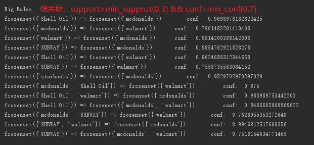
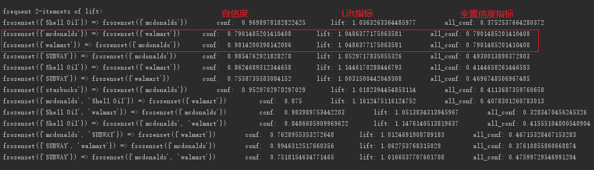
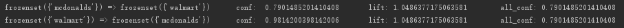

"# datamining_homework2" 

## 利用Apriori算法挖掘各种品牌店之间的关联

#### 数据源：
> 取自Consumer & Visitor Insights For Neighborhoods中的related_same_month_brands，这些数据记录了此CBG的访客在访问CBG的同一个月访问过的品牌。

#### 挖掘结果

- 频繁项集   

- 强规则（support>min_supprot && conf>min_conf）  

- 分别利用Lift和全自信度指标对规则的评价（主要对2项集进行评估）

  
	
	从Lift指标可以看出，在支持度为0.3，置信度为0.7的条件下，所有发现的规则都是正相关的
	从全自信度指标可以看出，只有两条规则的all_conf>min_conf
	这两条规则（有趣的规则）分别是：

	1.mcdonalds => walmart     
	conf:  0.79 		lift: 1.049 		all_conf: 0.790  
	2.walmart => mcdonalds   
	conf:  0.98 		lift: 1.049 		all_conf: 0.790  

	如下图所示：
	

#### 结论：
> 从以上挖掘可以看出，mcdonalds和walmart 两种品牌是相关的，一般去了其中一家的顾客也会去另一家，由此我们可以猜测，两个品牌的可能价格定位比较相近、风格也可能比较类似。

